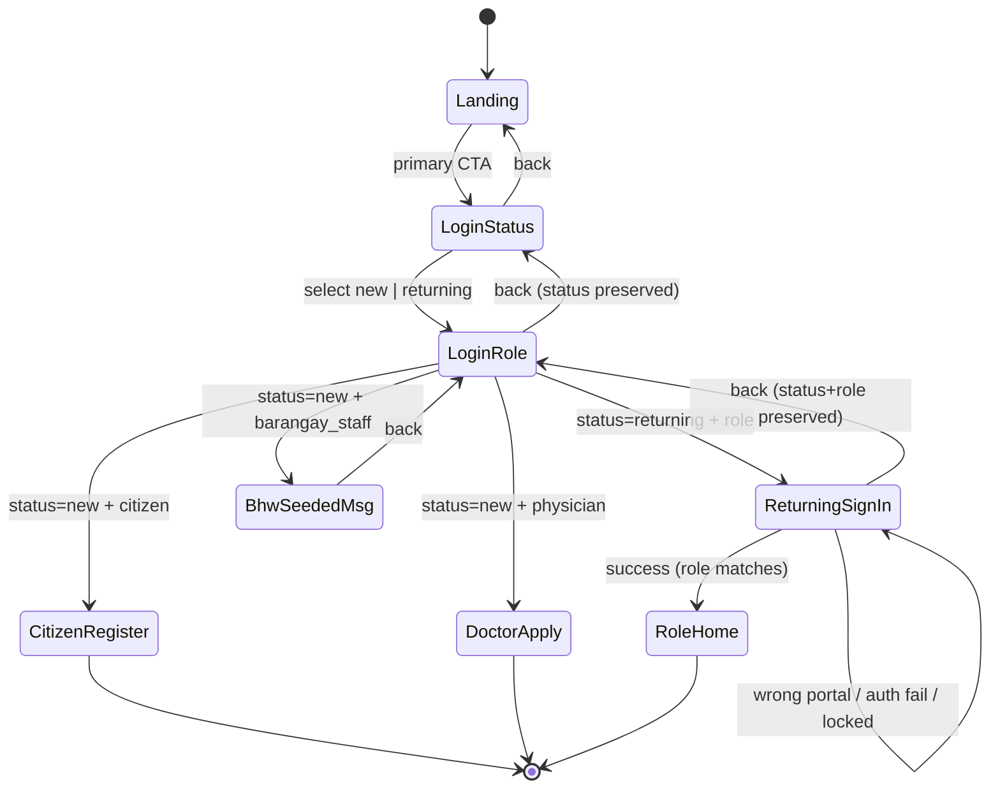

# Design Document

## Overview

This design reworks CareLink's unauthenticated entry experience from the current three-option role-selector landing (which links straight into role-pinned login portals) into a staged flow:

1. **Landing_Page** (`/`) — introduces CareLink, no role selector, a single primary call-to-action into the login page.
2. **Login_Page** (`/login`) — a client-side wizard: a **Status_Step** (new vs returning) first, then a **Role_Step** (citizen / physician / barangay_staff), then a per-combination **outcome** (role-pinned sign-in, registration redirect, or a BHW seeded-only message).
3. **Admin login** (`/admin/login`) — unchanged in spirit: URL-only, not linked from any public screen.

The design reuses the existing `AuthProvider` (`signInAs`, `roleHome`, `signUpCitizen`, `signUpDoctor`, `signOut`) and the existing registration/pending screens. The existing per-role portal wrapper components (`CitizenLogin`, `StaffLogin`, `DoctorLogin`) are removed in favor of role selection internalized in the Login_Page wizard; `AdminLogin` is kept for the URL-only admin route.

The one new external dependency is forms tooling: `react-hook-form`, `zod`, and `@hookform/resolvers`, which the steering mandates but which are not yet in `package.json`.

### Goals

- Landing and login are distinct routes (Req 1).
- Login is a staged status-then-role wizard with state-preserving back navigation (Req 2, 3).
- Each (status, role) combination routes to the correct outcome (Req 4, 5).
- Admin stays URL-only (Req 6).
- Mandated stack + accessibility are honored, including React Hook Form + Zod (Req 7).
- Steering docs are updated to describe the new flow as the authoritative intent (Req 8).

### Non-goals

- No change to the database, RLS, RPCs, or the real server-side security boundary. All role gating in this flow is UX convenience, consistent with `RequireRole`.
- No change to the citizen/doctor registration data model (email+password+PRC placeholder behavior is retained as-is).

## Architecture

### Flow and wizard state



The wizard lives entirely inside the `LoginPage` component. `CitizenRegister` and `DoctorApply` are navigations to the existing `/register` and `/register/doctor` routes (Req 5.1, 5.2); the Status_Step and Role_Step and the returning sign-in and the BHW message are rendered in-place within the Login_Page.

### Component and routing map

| Element | Location | Type |
|---|---|---|
| `LandingScreen` (redesigned) | `@/features/auth/LandingScreen.tsx` | default export, lazy route `/` |
| `LoginPage` (new wizard) | `@/features/auth/LoginPage.tsx` | default export, lazy route `/login` |
| `StatusStep` (new) | `@/features/auth/steps/StatusStep.tsx` | named export, child of LoginPage |
| `RoleStep` (new) | `@/features/auth/steps/RoleStep.tsx` | named export, child of LoginPage |
| `SignInForm` (new, RHF+Zod) | `@/features/auth/SignInForm.tsx` | named export, used by LoginPage + AdminLogin |
| `BhwSeededNotice` (new) | `@/features/auth/steps/BhwSeededNotice.tsx` | named export, child of LoginPage |
| `AdminLogin` (kept) | `@/features/auth/portals/AdminLogin.tsx` | default export, lazy route `/admin/login` |
| `RegisterScreen`, `DoctorRegisterScreen`, `PendingScreen` | unchanged | kept |
| `LoginScreen.tsx`, `portals/CitizenLogin.tsx`, `portals/StaffLogin.tsx`, `portals/DoctorLogin.tsx` | removed | superseded |

`SignInForm` is the extracted, RHF+Zod version of the current `LoginScreen` sign-in form. It takes `{ expectedRole, onBack }` and calls `signInAs`. `AdminLogin` renders `<SignInForm expectedRole="admin" />` with no public link.

Router changes in `@/app/router.tsx`:

- Keep `/` (now the redesigned `LandingScreen`) and `/admin/login` (`AdminLogin`).
- Replace `/login`, `/login/staff`, `/login/doctor` with a single `/login` -> `LoginPage`.
- Keep `/register`, `/register/doctor`, `/pending`, `/staff/masterlist` (RequireRole), and the `*` fallback.
- All auth screens remain lazy-loaded default exports via the existing `<Lazy>` Suspense wrapper.

## Components and Interfaces

### LoginPage wizard state machine (Req 2, 3)

Internal state held in component memory (not the URL):

```ts
type visitor_status = 'new' | 'returning';
type selectable_role = 'citizen' | 'physician' | 'barangay_staff';

type wizard_step =
  | { kind: 'status' }
  | { kind: 'role' }
  | { kind: 'signin'; role: selectable_role }   // returning outcome
  | { kind: 'bhw_seeded' };                       // new + barangay_staff outcome

interface login_wizard_state {
  status: visitor_status | null;
  step: wizard_step;
}
```

Transitions:

- Initial: `{ status: null, step: { kind: 'status' } }` — Status_Step shown first, nothing pre-selected (Req 2.1).
- Status_Step select -> set `status`, go to `{ kind: 'role' }` (Req 2.3, status retained).
- Status_Step back -> `navigate('/')`, discard status (Req 2.5).
- Role_Step guard: if `status === null` -> reset to `{ kind: 'status' }` (Req 3.6).
- Role_Step select role:
  - `status==='returning'` -> `{ kind: 'signin', role }` (Req 4.1-4.3).
  - `status==='new' && role==='citizen'` -> `navigate('/register')` (Req 5.1).
  - `status==='new' && role==='physician'` -> `navigate('/register/doctor')` (Req 5.2).
  - `status==='new' && role==='barangay_staff'` -> `{ kind: 'bhw_seeded' }` (Req 5.3).
- Role_Step back -> `{ kind: 'status' }`, status preserved (Req 3.4).
- signin back -> `{ kind: 'role' }`, status + role preserved (Req 4 back control).
- bhw_seeded back -> `{ kind: 'role' }` (Req 5.4).

Admin never appears in Role_Step choices (Req 3.2, 6.1).

### SignInForm (React Hook Form + Zod) (Req 4, 7)

```ts
const sign_in_schema = z.object({
  email: z.string().min(1, 'auth.error.email_required').email('auth.error.email_invalid'),
  password: z.string().min(1, 'auth.error.password_required'),
});
type sign_in_values = z.infer<typeof sign_in_schema>;

interface SignInFormProps {
  expectedRole: user_role;      // from AuthProvider
  onBack?: () => void;          // omitted for admin URL-only route
}
```

Behavior:

- `useForm({ resolver: zodResolver(sign_in_schema) })`. Empty email or password fails Zod -> submission blocked, values retained, field-level errors shown (Req 4.7, 7.2).
- On valid submit, call `signInAs(email.trim(), password, expectedRole)`:
  - `wrongPortal: true` -> show `auth.login.wrong_portal`; AuthProvider already signed the session out (Req 4.5).
  - `error` -> show `auth.login.failed`, clear the password field, retain email (Req 4.6). For the admin route this same generic message is used so account existence is not disclosed (Req 6.4).
  - success -> `AuthProvider`/route guards resolve `roleHome(role)`; navigate to `/` and let the landing/guard redirect to Role_Home (Req 4.4, 7.3).
- All error messages render inside a container with `role="alert"` (assertive) (Req 7.7).

### Client-side lockout (Req 4.8)

A per-email attempt counter lives in `LoginPage` wizard memory (a `Map<email, { fails: number; lockedUntil: number | null }>`), seeded fresh per Login_Page session. This is explicitly a UX convenience, not the security boundary (the server rate-limits auth independently).

- On auth failure, increment the counter for the normalized email.
- At 5 consecutive failures, set `lockedUntil = Date.now() + 15*60*1000`.
- While locked, `SignInForm` blocks submission and shows `auth.login.locked` (with remaining minutes via i18n interpolation).
- A successful auth resets the counter.

### Landing_Page redesign (Req 1)

- Single primary CTA (one `Link`/button to `/login`); no role options, no other sign-in/registration links (Req 1.2, 1.6).
- Authenticated-redirect logic preserved from the current screen but hardened:
  - `loading` or session-without-resolved-profile -> stay on Landing, no redirect (Req 1.7).
  - session + profile resolved to a defined role -> `Navigate` to `roleHome(role)` (Req 1.4).
  - session + profile resolves to no defined role -> stay on Landing, no redirect (Req 1.8).
- All text via i18n (Req 1.5).

## Data Models

No persistent data model changes. The only state introduced is transient UI state (`login_wizard_state`, the lockout map), held in component memory and discarded on unmount. Role names remain exactly `admin | barangay_staff | physician | citizen` from `AuthProvider.user_role` (Req 8.6). snake_case is used for the data-layer-facing types above.

## Dependencies

Add to `package.json` (pinned, npm only) — mandated by steering, currently missing:

- `react-hook-form`
- `zod`
- `@hookform/resolvers`

Install exact versions and commit the lockfile. No other new libraries; shadcn/ui primitives and Tailwind tokens already available are used for presentation.

## i18n keys

New keys added to both `@/lib/i18n/en.json` and `fil.json` (English is the fallback when a key is missing in the active language, Req 7.8). Existing `auth.*` keys are reused where possible; the role-selector `landing.subtitle` and per-role `landing.*_hint` keys tied to the old three-option landing are retired or repurposed.

| Key | Purpose | Requirement |
|---|---|---|
| `auth.landing.cta` | Single primary action label on Landing | 1.2 |
| `auth.landing.intro` | Product intro copy (replaces role-chooser subtitle) | 1.5 |
| `auth.status.title` | Status_Step heading | 2.4 |
| `auth.status.new` | "New to CareLink" choice | 2.2 |
| `auth.status.returning` | "I already have an account" choice | 2.2 |
| `auth.status.back` | Back to landing | 2.5 |
| `auth.role.title` | Role_Step heading | 3.5 |
| `auth.role.citizen` / `auth.role.physician` / `auth.role.barangay_staff` | Role choices (reuse `auth.portal.*` where suitable) | 3.1 |
| `auth.role.back` | Back to Status_Step | 3.4 |
| `auth.login.failed` | Auth-failure message | 4.6, 6.4 |
| `auth.login.locked` | Temporary lockout message (with `{{minutes}}`) | 4.8 |
| `auth.error.email_required` / `auth.error.email_invalid` / `auth.error.password_required` | Zod field errors | 4.7, 7.2 |
| `auth.bhw.seeded_title` / `auth.bhw.seeded_body` | BHW created-by-admin notice | 5.3 |
| `auth.bhw.back` | Back control on BHW notice | 5.4 |

Existing reused keys: `auth.field.email`, `auth.field.password`, `auth.login.title/submit/submitting`, `auth.login.wrong_portal`, `auth.register.*`, `auth.doctor.*`, `auth.pending.*`.

## Steering document updates (Req 8)

These edits capture the new flow as the authoritative intent.

`.kiro/steering/product.md`:
- Replace the "Single `/login` page (one email + password form, no role selector; server routes by role after auth)" statement with a description of the staged flow: a landing page, a separate login page, a new-vs-returning step, then a role step (citizen/doctor/BHW), with admin excluded from public choices (Req 8.1, 8.2).
- Keep BHW seeded-by-admin and doctor-apply statements; keep role names (Req 8.4, 8.6).

`.kiro/steering/structure.md`:
- Update the Route map "Public" row to: `/` (landing, single CTA), `/login` (staged status->role wizard), `/register`, `/register/doctor`, `/admin/login` (URL-only), `/activate`, `/q/:payload`. Remove `/login/staff` and `/login/doctor` (Req 8.3).
- Note the login page internalizes role selection; admin login is URL-only and unlinked (Req 8.5).
- Keep both files consistent with each other (Req 8.7).

## Error Handling

| Condition | Handling | Requirement |
|---|---|---|
| Empty email/password | Zod blocks submit, field errors, values retained | 4.7, 7.2 |
| Invalid credentials | `auth.login.failed`, clear password, retain email | 4.6 |
| Role mismatch (wrong portal) | session dropped by `signInAs`, `auth.login.wrong_portal` | 4.5 |
| 5 failures / same email | 15-min client lockout, `auth.login.locked` | 4.8 |
| Admin auth failure | generic `auth.login.failed`, no account-existence disclosure | 6.4 |
| Role_Step reached with no status | reset to Status_Step | 3.6 |
| Missing i18n key in active language | fall back to English | 7.8 |
| All error containers | `role="alert"` | 7.7 |

## Correctness Properties

Invariants the implementation must uphold. These are stated so they can be checked by unit/property tests and review.

### Property 1: Status precedes role
The wizard can only reach a `role` step after `status` is non-null; reaching `role` with `status === null` resets to the `status` step.

**Validates: Requirements 2.1, 3.6**

### Property 2: Status preserved across role back-navigation
Going from `role` back to `status` and forward again never changes a previously chosen `status` unless the user re-selects it.

**Validates: Requirements 3.4**

### Property 3: Admin is never a public choice
No code path renders an `admin` option in the Landing_Page, Status_Step, or Role_Step; `admin` sign-in is reachable only via the `/admin/login` route.

**Validates: Requirements 3.2, 6.1**

### Property 4: Outcome is a total function of (status, role)
Every one of the six (status in {new, returning}) x (role in {citizen, physician, barangay_staff}) combinations maps to exactly one defined outcome, with no combination left undefined.

**Validates: Requirements 4.1, 4.2, 4.3, 5.1, 5.2, 5.3**

### Property 5: Role-pinned sign-in admits only the matching role
A successful authentication whose profile role differs from the Selected_Role always ends the session and never routes to any Role_Home.

**Validates: Requirements 4.5**

### Property 6: No navigation on invalid credentials
A failed or empty-field submission never advances past the sign-in view and never clears the entered email.

**Validates: Requirements 4.6, 4.7**

### Property 7: Lockout is monotonic within a session
Once 5 consecutive failures occur for an email, submissions for that email stay blocked until the 15-minute window elapses or a successful auth resets the counter; the counter never silently decreases below a prior failure count without a success.

**Validates: Requirements 4.8**

### Property 8: i18n totality
Every user-facing string rendered by the flow resolves to a key present in `en.json`; `fil.json` missing keys fall back to English rather than rendering a raw key.

**Validates: Requirements 7.6, 7.8**

## Testing Strategy

Per steering testing rules (Vitest + Testing Library units; Playwright e2e at phone 360px and desktop with axe).

Unit (Vitest + Testing Library):
- Wizard state machine: initial state shows Status_Step, nothing pre-selected (Req 2.1); status select advances to Role_Step and retains status (Req 2.3); back controls preserve state (Req 3.4, 4 back); Role_Step with null status resets to Status_Step (Req 3.6); each (status, role) transition yields the correct outcome (Req 4.1-4.3, 5.1-5.4); admin never offered (Req 3.2).
- Zod schema: empty email, empty password, malformed email each reject with the right key (Req 4.7, 7.2).
- SignInForm: wrongPortal -> wrong_portal message (Req 4.5); auth fail -> failed message + password cleared + email retained (Req 4.6); lockout after 5 fails blocks and messages (Req 4.8).
- Landing redirect guards: loading/no-profile -> no redirect; resolved role -> roleHome (Req 1.4, 1.7, 1.8).

E2E (Playwright, 360px + desktop, axe on each route group):
- Full happy paths: landing -> login -> returning + citizen sign-in -> `/me`; new + citizen -> `/register`; new + physician -> `/register/doctor`; new + BHW -> seeded notice -> back.
- Admin: `/admin/login` reachable directly; not linked from landing/login (Req 6).
- Accessibility: axe clean, 44px targets, no horizontal scroll at 360px (Req 7.4, 7.5), alert roles present (Req 7.7).

## Requirements Coverage

| Requirement | Design sections |
|---|---|
| 1 Landing distinct from login | Architecture (routing map), Landing_Page redesign |
| 2 Status step | Wizard state machine (status transitions) |
| 3 Role step | Wizard state machine (role transitions, null-status guard) |
| 4 Returning routing | SignInForm, Client-side lockout, Error Handling |
| 5 New routing | Wizard state machine (new outcomes), BhwSeededNotice |
| 6 Admin URL-only | Component/routing map, SignInForm (admin generic failure) |
| 7 Tech + accessibility | SignInForm (RHF+Zod), Dependencies, i18n, Testing Strategy |
| 8 Steering docs | Steering document updates |
