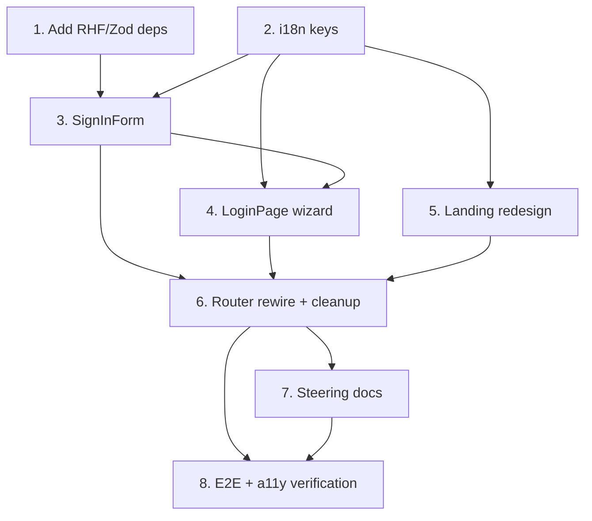

# Implementation Plan

## Overview

This plan reworks the CareLink unauthenticated entry flow into a landing page plus a staged login wizard (status -> role -> outcome), reusing the existing `AuthProvider` (`signInAs`, `roleHome`) and registration screens. It adds the mandated React Hook Form + Zod tooling, extracts a reusable `SignInForm`, builds the `LoginPage` wizard and the redesigned landing, rewires the router (removing the per-role portal routes while keeping admin URL-only), updates the steering docs to the new authoritative flow, and verifies with unit, e2e, and accessibility tests.

## Task Dependency Graph



```json
{
  "waves": [
    { "wave": 1, "tasks": ["1", "2"] },
    { "wave": 2, "tasks": ["3", "5"] },
    { "wave": 3, "tasks": ["4"] },
    { "wave": 4, "tasks": ["6"] },
    { "wave": 5, "tasks": ["7"] },
    { "wave": 6, "tasks": ["8"] }
  ]
}
```

## Tasks

- [x] 1. Add forms tooling dependencies
  - Install `react-hook-form`, `zod`, and `@hookform/resolvers` with npm at pinned versions and commit the updated lockfile
  - Verify `npm run typecheck` and `npm run build` still pass after install
  - _Requirements: 7.2_

- [x] 2. Add i18n keys for the new flow (en + fil)
  - Add the new `auth.landing.cta`, `auth.landing.intro`, `auth.status.*`, `auth.role.*`, `auth.login.failed`, `auth.login.locked`, `auth.error.*`, and `auth.bhw.*` keys to `src/lib/i18n/en.json`
  - Mirror every new key in `src/lib/i18n/fil.json` (Filipino values; English remains the runtime fallback)
  - Retire or repurpose the old three-option landing keys (`auth.landing.subtitle`, `auth.landing.*_hint`) no longer referenced
  - _Requirements: 7.6, 7.8_

- [x] 3. Extract the role-pinned sign-in form into SignInForm with React Hook Form + Zod
  - [x] 3.1 Create `src/features/auth/SignInForm.tsx` (named export) with `{ expectedRole, onBack? }`
    - Define the `sign_in_schema` Zod object (email required + valid, password required) and wire `useForm` with `zodResolver`
    - Call `signInAs(email.trim(), password, expectedRole)`; on `wrongPortal` show `auth.login.wrong_portal`, on error show `auth.login.failed` and clear only the password, on success navigate to `/` for the guard-driven redirect
    - Render all field and form errors in a `role="alert"` container; keep every control at a 44px minimum touch target
    - _Requirements: 4.1, 4.2, 4.3, 4.4, 4.5, 4.6, 4.7, 7.2, 7.3, 7.7_
  - [x] 3.2 Add per-email client-side lockout to SignInForm
    - Track consecutive failures per normalized email; at 5 failures block submissions for 15 minutes and show `auth.login.locked` with remaining minutes; reset on success
    - _Requirements: 4.8_
  - [x] 3.3 Write Vitest + Testing Library unit tests for SignInForm and the Zod schema
    - Cover empty email, empty password, malformed email, wrong-portal, auth-failure (password cleared, email retained), and lockout-after-5-failures
    - _Requirements: 4.5, 4.6, 4.7, 4.8, 7.2_

- [x] 4. Build the LoginPage wizard
  - [x] 4.1 Create step components `src/features/auth/steps/StatusStep.tsx`, `RoleStep.tsx`, and `BhwSeededNotice.tsx` (named exports)
    - StatusStep: two mutually exclusive choices (new/returning), nothing pre-selected, back-to-landing control, all text via i18n
    - RoleStep: exactly citizen/physician/barangay_staff (no admin), back-to-status control, all text via i18n
    - BhwSeededNotice: `auth.bhw.seeded_*` message plus a 44px back-to-role control
    - _Requirements: 2.1, 2.2, 2.4, 2.5, 3.1, 3.2, 3.4, 3.5, 5.3, 5.4_
  - [x] 4.2 Create `src/features/auth/LoginPage.tsx` (default export) implementing the wizard state machine
    - Hold `{ status, step }` in component memory; initial step is `status`
    - Status select -> role step (status retained); role step guard resets to status when status is null
    - Returning + role -> render `SignInForm`; new + citizen -> `navigate('/register')`; new + physician -> `navigate('/register/doctor')`; new + barangay_staff -> BhwSeededNotice
    - Preserve status/role on every back transition
    - _Requirements: 2.1, 2.3, 2.5, 3.3, 3.4, 3.6, 4.1, 4.2, 4.3, 5.1, 5.2, 5.3, 5.4_
  - [x] 4.3 Write Vitest + Testing Library unit tests for the wizard state machine
    - Initial state shows StatusStep with nothing selected; status advance retains status; back controls preserve state; null-status guard resets to status; all six (status, role) outcomes resolve correctly; admin never rendered as a choice
    - _Requirements: 2.1, 2.3, 3.2, 3.4, 3.6, 4.1, 4.2, 4.3, 5.1, 5.2, 5.3_

- [~] 5. Redesign the Landing page
  - Rewrite `src/features/auth/LandingScreen.tsx` to a single primary CTA to `/login` with no role options and no other sign-in/registration links
  - Harden the authenticated-redirect: stay on landing while loading or when session has no resolved profile/role; redirect to `roleHome(role)` only when a defined role resolves
  - Route all text through i18n
  - Add unit tests for the three redirect guard states (loading/no-profile -> no redirect; resolved role -> roleHome)
  - _Requirements: 1.1, 1.2, 1.4, 1.5, 1.6, 1.7, 1.8_

- [~] 6. Rewire the router and remove superseded screens
  - Update `src/app/router.tsx`: `/login` -> `LoginPage`; remove `/login/staff` and `/login/doctor`; keep `/admin/login` -> `AdminLogin`, `/`, `/register`, `/register/doctor`, `/pending`, `/staff/masterlist`, and the `*` fallback; keep all auth screens lazy-loaded default exports
  - Point `AdminLogin` at `SignInForm` (`expectedRole="admin"`, no `onBack`); ensure the admin failure path shows the generic `auth.login.failed` without disclosing account existence
  - Delete `LoginScreen.tsx`, `portals/CitizenLogin.tsx`, `portals/StaffLogin.tsx`, `portals/DoctorLogin.tsx`; update `src/features/auth/index.ts` if its public API changes
  - _Requirements: 1.3, 6.1, 6.2, 6.3, 6.4, 7.1_

- [~] 7. Update the steering documents to the new flow
  - Edit `.kiro/steering/product.md` to supersede the single-`/login` / no-role-selector statement with the staged landing -> login -> status -> role description; keep BHW seeded-by-admin, admin-URL-only, and the role names
  - Edit `.kiro/steering/structure.md` Route map "Public" row to `/`, `/login`, `/register`, `/register/doctor`, `/admin/login`, `/activate`, `/q/:payload` (remove `/login/staff` and `/login/doctor`) and note login internalizes role selection
  - Ensure the two files do not contradict each other
  - _Requirements: 8.1, 8.2, 8.3, 8.4, 8.5, 8.6, 8.7_

- [~] 8. End-to-end and accessibility verification
  - Add Playwright e2e specs at 360px and desktop for: landing -> login -> returning+citizen sign-in -> `/me`; new+citizen -> `/register`; new+physician -> `/register/doctor`; new+BHW -> seeded notice -> back; `/admin/login` reachable directly but not linked from public screens
  - Run axe accessibility checks on the landing and login route group; assert 44px targets, no horizontal scroll at 360px, and alert roles on errors
  - Run `npm run lint`, `npm run typecheck`, and `npm run test` and fix any failures
  - _Requirements: 6.1, 7.1, 7.4, 7.5, 7.7_

## Notes

- Tasks 1 and 2 are independent and can run in parallel; both must land before task 3/4.
- The `admin` role is intentionally excluded from every public choice; it is reachable only via the unlinked `/admin/login` route (task 6).
- All role gating in this flow is UX convenience; the real security boundary stays in the database (RLS + RPCs) and is unchanged by this plan.
- Steering doc edits (task 7) encode the authoritative intent and must stay consistent between `product.md` and `structure.md`.
